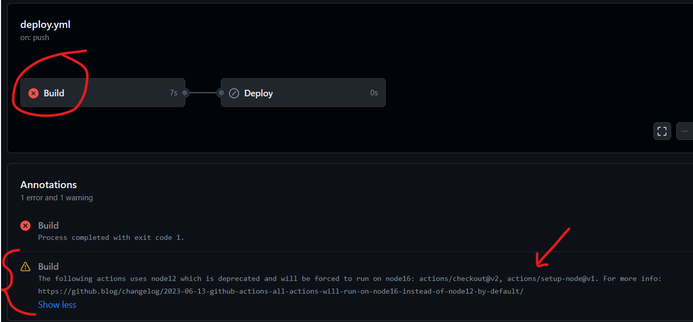

## FoodFetch ReactJS app using API
~ website is live [here](https://foodfetch.vercel.app/)  
~ Implemented search functionality using an API, where you can get details of products/foods based on your search.

#### Errors faced:-

- (refer)[https://stackoverflow.com/questions/75061837/github-actions-node-js-12-actions-are-deprecated-although-i-upgraded-everyt] on how to rectify it.
